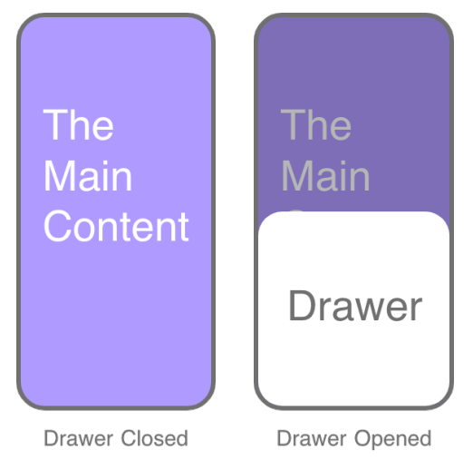
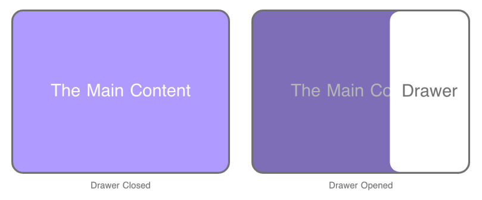

Test Project

Module C

Web Technologies

# Introduction

Old Shanghai Restaurant requires a mobile- and tablet-first ordering website for dine-in and take-away customers. Dine-in customers identify their table by scanning a QR code with the device camera or by uploading a local QR image. Take-away customers can enter the menu directly. The product is a single-page web application. No page reloads shall occur for any operations.

The provided media files include menu data, QR image-reading helper code, table QR images and dish images. Competitors must import the menu data and submit an export of the final database as "db_dump.sql".

# Description of project and tasks

## Database

Import every record from "menu.csv". The following is a reference structure. Competitors may refer to this structure to complete the design of database tables in accordance with the functional requirements of the competition task.

### dishes

- name
- category
- description
- price
- stock
- image_path

### orders

- order_number
- type (Indicates whether the order is dine-in or takeaway)
- total_amount

### order_items

- order_id
- dish_id
- dish_name
- unit_price
- quantity
- line_total

Each order has one or more order items. Each order item refers to one dish and must preserve the purchased dish name and unit price as an order snapshot.

## Home view

- Display three primary buttons: "Dine In", "Take Away" and "My Orders".
- After selecting "Dine In", open a drawer and show the "Scan Now" and "Upload QR Code" buttons in the drawer.
- Selecting "Scan Now" must execute code that requests access to the device camera.
- Selecting "Upload QR Code" must open a local image file input and decode the selected image.
- A valid table payload uses the format "old-shanghai://table/{number}", where "{number}" is an integer from 1 to 10. A valid result opens the menu and shows that table number.
- If image decoding fails or the decoded value is not a valid table payload, display exactly "QR code parsing failed" and remain on the home view.
- Selecting "Take Away" opens the menu directly and creates a take-away reference that remains unchanged during refresh. Display the reference with the prefix "Take-away No.".
- The takeaway reference shall be a randomly generated 6-digit numeric string and must be unique.

## Menu view

- The fixed header displays the current table number or take-away reference and a back to home button.
- Display every imported dish with its image, name, category, unit price, stock status, selected quantity, add control and subtract control.
- On mobile devices, each row displays one dish; on tablets, two to three dishes shall be shown per row adaptively based on page width.
- Do not display the numeric stock value. Display "Out of Stock" when stock is 0, "Low Stock" when stock is from 1 to 9, and "In Stock" when stock is 10 or more.
- The add control increases quantity by one. The subtract control decreases quantity by one but must never reduce it below 0.
- A dish with quantity 0 must not exist in the cart.
- The maximum selected quantity for one dish is 10. If stock is below 10, the maximum is the current stock value. A dish with stock 0 cannot be added.
- Every quantity change must immediately update the bottom-bar dish quantity and total price.
- The fixed bottom bar displays "Cart", the total dish quantity, the total price and "Checkout".

## Cart and persistent state

- Clicking"Cart" or "Checkout" opens a drawer.
- The drawer displays all selected dishes, showing each item's image, name, unit price, quantity and line subtotal. Below these items are the total price and a "**Confirm**" button to submit the cart.
- The drawer supports adding, subtracting and deleting dishes. The same quantity and stock limits apply in the menu and drawer. A dish will be removed from the cart when its quantity is reduced to zero.
- The cart drawer contains a "Confirm" button for order submission.
- Refreshing the menu must restore every cart item, quantity and the current table or take-away reference.
- If the cart is empty, clicking back to home button returns directly to the home view.
- If the cart contains dishes, clicking back to home button opens a dialog containing exactly "Return to the home page? Unsubmitted cart items will be cleared.". The actions are "Cancel" and "Return Home".
- Clicking "Return Home" clears all unsubmitted cart and service-context data before opening the home view.

## Checkout and order processing

- Clicking "Confirm" with an empty cart displays exactly "Please select at least one dish" and must not show the result view.
- Use the current table or take-away reference and selected dish to create the order.
- Before saving the order, verify that each selected dish exists and that the requested quantity does not exceed the current stock.
- If the stock quantity of any dish added to the cart becomes insufficient when submitting the order, terminate the submission process, show the prompt "Some dishes in your cart are out of stock", and highlight the corresponding dishes. This scenario occurs when two users add the same low-stock dish to their carts simultaneously; if one user completes the order first, the other user will receive this prompt.
- Store the order and its purchased dishes in the database, including an order number and ordered time.
- After a successful order, reduce each purchased dish's stock by its ordered quantity. Stock must never become negative.
- After a successful order, clear the stored cart and open the result view.

## Result view

- Display the table number or take-away reference.
- Display the order number and ordered time.
- Display every purchased dish with image, dish name, unit price and quantity.
- Display line subtotals and the total order price.

## My Orders view

- List all orders submitted by the current device in descending order of ordered time.
- Each order entry shall display the order number, ordered time and total amount.
- Clicking an order entry opens the result view and displays the detailed data of the corresponding order.

## Drawer Component

Drawer is a front-end interactive component. Its show and hide animations are slide-in and slide-out transitions originating from the edge of the viewport. When opened on mobile devices, its main content slides upward from the bottom of the viewport. The page content will be covered by the drawer's mask layer. Clicking the mask layer of the drawer closes the drawer component.

On tablet devices, the drawer component shall slide its main content in from the right side of the viewport.

# Instructions to the Competitor

- Use the supplied menu data. Do not replace the provided dish records with different records.
- Submit the final database export as "db_dump.sql" in the project root. The file must contain imported menu data, a reasonable data structure, and comply with Third Normal Form.
- Use the decodeQrFile method from qr-image-reader.js (parameter: a File object) to parse the QR Code image.
- Home, menu, result, my orders views must change without a full document reload.
- All prices shown to the customer must use exactly two decimal places.

# Other

The workstation does not provide camera hardware. Competitors only need to implement the code to open and request camera access for the "Scan Now" function. Since physical camera hardware is unavailable, judges will evaluate the relevant source code instead of testing live camera capture. Uploading and decoding a local QR image remains fully assessable.

# Marking Summary

| **Sub-Criteria**              | **Marks** |
| ----------------------------- | --------- |
| Database structure            | 4.1       |
| Home View                     | 4         |
| Menu View                     | 9.6       |
| Cart                          | 4.2       |
| Checkout and order processing | 4         |
| Result View                   | 2.1       |
| My Orders view                | 1.2       |
| Application Functionality     | 3.8       |
| **Total**                     | **33.0**  |
